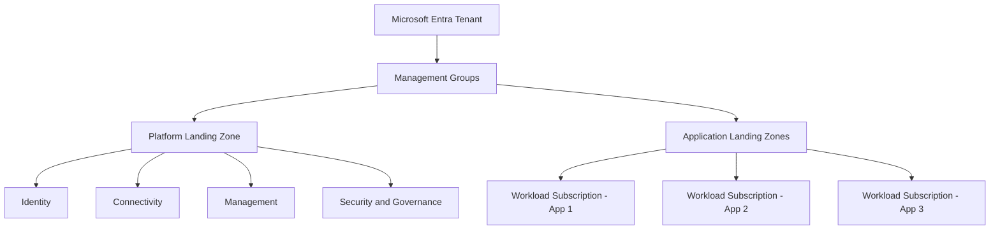

Remember that parable about building your house on sand?

The same applies to your application stacks.

No one wants to end up on *Rogue Traders* because they’ve held a production environment together with a prayer, some pliers, and one very brave firewall rule.

Having worked in MSPs over the years, there are few things more unnerving than a “Landing Zone Review” task.

Most of the time, you end up feeling like the builder who comes in after the previous one and says:

> “Blinking heck, who’s done this?”

And the awkward bit?

It was probably someone trying to help under pressure, with too little time and not enough foundation to work from.

How it usually gets messy:

One team creates a subscription called “Azure subscription 1”.  
Another team builds a virtual network.  
Someone deploys a firewall because “firewalls are secure, right?”  
Tags are optional.  
Naming standards are an abstract concept.  
Monitoring gets added after the outage.

Then six months later, nobody is quite sure who owns what, which workloads are compliant, where logs are going, or why there’s a firewall just existing with no rules.

That is the problem **Azure landing zones** are designed to solve.

This is the first post in my Azure landing zone series, where I’ll break down Microsoft’s guidance in plain English and connect it to real-world Azure architecture decisions.

No fluff.  
No copy-paste documentation, or at least I’ll try.  
Just practical cloud foundations explained properly.

---

## The problem: Azure is simple, yet hard to untangle

Azure makes it very easy to get started.

That is both a strength and a trap.

You can create a resource group, deploy a VM, spin up an App Service, connect a database, expose an endpoint, and job’s a good’un.

And to be fair, sometimes it is.

But cloud environments grow quickly.

What starts as:

> “We just need to get this app live”

can quickly become:

> “We now have production, dev, test, shared networking, private endpoints, hybrid connectivity, compliance requirements, privileged access, cost reporting, backup policies, security alerts, and multiple teams deploying things differently.”

And that’s when it gets overwhelmingly difficult to unpick.

The issue is not usually that teams lack technical skill, either.

The issue is that the foundation was never designed intentionally.

---

## ELI5: what is an Azure landing zone?

Imagine you are building a housing estate.

You would not start by letting everyone build houses wherever they like.

Before the houses go up, you need:

- roads
- drainage
- electricity
- boundaries
- street lighting
- access rules
- safety standards
- planning permission
- shared services
- maintenance responsibilities

That is the foundation that allows homes to be built safely and consistently.

An **Azure landing zone** is similar.

It is the prepared foundation that allows teams to deploy Azure workloads in a secure, governed, scalable, and consistent way.

A landing zone is not just:

- a subscription
- a virtual network
- a naming convention
- a Terraform repo
- a set of Azure Policy assignments
- a lush architecture diagram

It can include all of those things, but it is bigger than any single component.

A landing zone is the combination of architecture, governance, security, identity, networking, operations, and automation that makes Azure usable at scale.

Put simply:

> An Azure landing zone is where your workloads land safely. A bit like a bouncy castle, but for governance. Less fun at parties, much better during audits.

---

## How Microsoft describes it

Microsoft describes Azure landing zones as the recommended approach for setting up and managing Azure environments at scale.

The guidance is part of the **Microsoft Cloud Adoption Framework**, especially the **Ready** methodology.

In plain English, the Ready phase asks:

> “Before we put important workloads in Azure, have we prepared the environment properly?”

That preparation includes important design areas such as:

- resource organization
- identity and access management
- network topology and connectivity
- security
- governance
- management
- business continuity
- platform automation and DevOps

Microsoft also separates the idea of landing zones into two useful categories:

| Landing zone type | What it means |
|---|---|
| **Platform landing zone** | Shared foundation services such as identity, connectivity, management, governance, and security |
| **Application landing zone** | The environment where actual workloads and applications are deployed |

That split matters.

The platform team should not have to redesign networking every time a new application goes live.

Application teams should not have to invent governance from scratch.

Security teams should not have to chase every workload after deployment.

A good landing zone gives each team a clearer place to work from.

---

## CAF, WAF, and landing zones without the jargon

You will often hear three Microsoft terms together:

- Cloud Adoption Framework
- Azure landing zones
- Azure Well-Architected Framework

They are related, but they are not the same thing.

Here is the simple version.

**Cloud Adoption Framework**, or CAF, helps organizations plan and manage their cloud adoption journey.

**Azure landing zones** help prepare the Azure environment so teams can deploy workloads consistently.

**Azure Well-Architected Framework**, or WAF, helps teams design and improve individual workloads across reliability, security, cost optimization, operational excellence, and performance efficiency.

My practical way of remembering it:

> CAF helps you adopt cloud.  
> Landing zones prepare the platform.  
> WAF improves the workloads.

That is not an official Microsoft phrase.  
That is just the mental model I use when explaining it to clients and peers.

I’ll go deeper into how these three fit together in the next post.

---

## A real-world scenario

Let’s say a company starts with one Azure subscription.

At first, it works fine.

They deploy a few resource groups:

- one for a web app
- one for a database
- one for networking
- one for a test environment

Then the business grows.

Now they need:

- production and non-production separation
- different access for developers, operators, and security teams
- private connectivity back to on-premises
- central logging
- Microsoft Defender for Cloud
- cost reporting by application
- policies for allowed regions
- tagging standards
- backup requirements
- audit evidence
- disaster recovery planning

Suddenly, the original subscription feels like that drawer everyone has at home: full of cables, sweet wrappers, old receipts, and things nobody wants to take ownership of.

Everything is technically “in Azure,” but the environment is difficult to govern.

Nobody wants to rebuild the foundation once production workloads are already sitting on top of it.

That is where landing zones help.

They encourage you to think about structure before scale makes structure painful.

---

## The technical view

At a high level, an Azure landing zone usually involves decisions around:

- Microsoft Entra ID
- management groups
- subscriptions
- resource groups
- Azure Policy
- Azure role-based access control
- networking
- DNS
- monitoring
- security tooling
- backup and recovery
- deployment automation

One of the most important concepts is the **management group hierarchy**.

Management groups allow you to organize subscriptions and apply governance controls above the subscription level.

That matters because once you have many subscriptions, you do not want to configure everything one subscription at a time.

Management groups are important because they let you apply governance above individual subscriptions rather than repeating the same controls everywhere.

For example, you may have a hierarchy that separates:

- platform services
- production workloads
- non-production workloads
- sandbox environments
- decommissioned subscriptions

Then policies, access controls, and standards can be applied at the right level.

The aim is not to make Azure complicated.

The aim is to make Azure predictable.

---

## Example landing zone view

Here is a simplified view of the idea:

In plain English:

The **platform landing zone** provides the shared foundation.

The **application landing zones** are where business workloads live.

The platform gives teams the roads, rules, security, connectivity, and shared services.

The application teams build on top of that foundation.

---

## Practical note: don’t blindly copy the reference architecture

Microsoft provides reference architecture and implementation options for Azure landing zones.

That guidance is valuable.

But your goal should not be to copy a diagram without understanding it.

Your goal should be to understand the design principles, then tailor the architecture to your organization.

A small company with a few workloads does not need the same operating model as a global enterprise with hundreds of subscriptions, strict compliance requirements, and multiple platform teams.

The pattern matters.

The context matters too.

---

## Common mistakes

### 1. Thinking a landing zone is just a subscription

A subscription can be part of a landing zone, but it is not the landing zone by itself.

A landing zone is the wider architecture and operating model around that subscription.

### 2. Starting with workloads before designing the foundation

This is probably the most common mistake.

It feels faster at the beginning, but it usually creates more work later.

### 3. Treating networking as an afterthought

Networking decisions are hard to reverse once workloads depend on them.

Think carefully about connectivity, DNS, private access, hybrid routing, and inspection requirements early.

### 4. Giving people access directly instead of using a proper model

Direct user permissions may feel simple, but they become difficult to manage.

Use groups, roles, least privilege, and clear ownership boundaries.

### 5. Adding governance only after something goes wrong

Azure Policy, tagging, allowed regions, diagnostic settings, and security controls are much easier to apply before the environment is full of production systems.

### 6. Thinking the landing zone is “done”

A landing zone is not a one-time project.

It is a platform capability.

It should evolve as your organization, workloads, security requirements, and Azure services evolve.

---

## Design considerations

When thinking about your own Azure landing zone, start with questions like these.

### Governance

- How will subscriptions be organized?
- Which policies should apply everywhere?
- Which policies should vary by environment?
- How will naming and tagging work?

### Security

- Who gets access?
- How is privileged access managed?
- How are security recommendations reviewed?
- How are logs collected and retained?

### Networking

- Will workloads be internet-facing, private, or hybrid?
- Do you need hub-spoke networking, Azure Virtual WAN, or a simpler pattern?
- Where will DNS be managed?
- How will private endpoints be handled?

### Operations

- Where do logs go?
- Who responds to alerts?
- What is monitored centrally?
- What is the responsibility of each workload team?

### Cost

- How are costs tracked?
- Are tags mandatory?
- Who owns budget alerts?
- How are shared platform costs handled?

These questions are not glamorous.

But they are the questions that prevent cloud chaos.

---

## Key takeaways

- Azure landing zones help create a secure, governed, and scalable foundation for Azure workloads.
- A landing zone is more than a subscription, network, policy set, or deployment template.
- The real value is consistency across identity, governance, security, networking, and operations.
- Microsoft’s Cloud Adoption Framework helps structure the adoption journey.
- The Azure Well-Architected Framework helps improve workload design.
- Build the foundation before Azure becomes difficult to untangle.

---

## Official Microsoft references

Only official Microsoft documentation was used for this article:

- Microsoft Learn: What is an Azure landing zone?  
  https://learn.microsoft.com/en-us/azure/cloud-adoption-framework/ready/landing-zone/

- Microsoft Learn: Azure landing zone design areas  
  https://learn.microsoft.com/en-us/azure/cloud-adoption-framework/ready/landing-zone/design-areas

- Microsoft Learn: Ready your Azure environment for workloads  
  https://learn.microsoft.com/en-us/azure/cloud-adoption-framework/ready/

- Microsoft Learn: What is the Azure Well-Architected Framework?  
  https://learn.microsoft.com/en-us/azure/well-architected/what-is-well-architected-framework

- Microsoft Learn: Platform landing zone implementation options  
  https://learn.microsoft.com/en-us/azure/cloud-adoption-framework/ready/landing-zone/implementation-options

---

## Next article

In the next post, I’ll break down how the **Cloud Adoption Framework**, **Azure landing zones**, and the **Azure Well-Architected Framework** fit together.

They are often mentioned in the same conversations, but they solve different parts of the Azure architecture puzzle.

Understanding that relationship makes the rest of Azure architecture much easier to reason about.